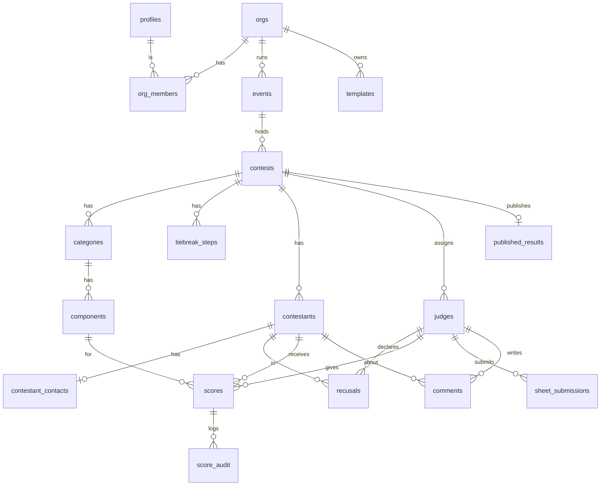

# 01 — Domain Model

Every table has `id uuid pk default gen_random_uuid()` and `created_at timestamptz default now()`. Only extra columns are listed below. Every table has RLS enabled (see [03-auth-rls.md](03-auth-rls.md)).

## ERD

## Tables

### Tenancy & identity
| Table | Columns | Notes |
|---|---|---|
| `profiles` | `id` (= `auth.users.id`), `display_name`, `is_platform_admin bool default false` | Created by a trigger on signup. Users can't change `is_platform_admin` themselves. |
| `orgs` | `name` | The creator becomes a producer through an RPC `create_org(name)`. URLs use the id. |
| `org_members` | `org_id`, `user_id`, `role` ∈ `producer`,`tabulator` | unique(org_id,user_id). An org always keeps at least 1 producer (trigger). |

### Structure
| Table | Columns | Notes |
|---|---|---|
| `events` | `org_id`, `name`, `starts_on date`, `venue text null` | |
| `contests` | `event_id`, `name`, `status` ∈ `draft`,`scoring`,`finalized`,`published`; `aggregation` ∈ `sum`,`drop_high_low`; `threshold_pct numeric(5,2) null` (null = no threshold); `anonymize_comments bool default true`; `manual_winner_contestant_id null`; `manual_winner_reason text null` | Denormalized `org_id` column (set by trigger) keeps RLS predicates cheap. |
| `categories` | `contest_id`, `name`, `sort int`, `drop_rank int null` | `drop_rank` 1 = dropped first in tiebreaks. |
| `components` | `category_id`, `name`, `min_points numeric(6,2) default 0`, `max_points numeric(6,2)`, `step numeric(4,2) default 1`, `sort int`, `description text null` | CHECK `max_points > min_points`, `step > 0`. |
| `tiebreak_steps` | `contest_id`, `step_no int`, `category_ids uuid[]` | unique(contest_id, step_no). Auto-generated from `drop_rank`, then editable. |

### People
| Table | Columns | Notes |
|---|---|---|
| `contestants` | `contest_id`, `display_name`, `number int null`, `represents text null` (e.g. "Mr Chicago Leather 2026"), `sort int`, `withdrawn bool default false` | No legal name, phone or address, ever. |
| `contestant_contacts` | `contestant_id pk`, `email` | Split out so judges and tabulators can read contestants without seeing emails. |
| `judges` | `contest_id`, `name`, `email null`, `user_id null`, `sort int` | `user_id` stays null in P1 (the producer enters for them). It's set when the judge claims the seat (P2). unique(contest_id, user_id). |
| `recusals` | `judge_id`, `contestant_id`, `reason text null` | unique(judge_id, contestant_id). |

### Scoring
| Table | Columns | Notes |
|---|---|---|
| `scores` | `judge_id`, `contestant_id`, `component_id`, `value numeric(6,2)`, `entered_by uuid`, `updated_at` | **unique(judge_id, contestant_id, component_id)**. A trigger validates min ≤ value ≤ max and that `(value - min) % step = 0`, and rejects writes when the sheet is locked or the contest isn't in `scoring`. |
| `sheet_submissions` | `judge_id`, `contestant_id`, `category_id`, `submitted_at`, `submitted_by`, `unlocked_at null`, `unlocked_by null`, `unlock_reason null` | A sheet is locked when `submitted_at` is set and `unlocked_at` is null. Re-submitting clears the unlock fields. |
| `score_audit` | `score_id`, `judge_id`, `contestant_id`, `component_id`, `old_value`, `new_value`, `changed_by`, `changed_at`, `op` ∈ `insert`,`update`,`delete` | Written only by a trigger (security definer). No update or delete from anyone. |
| `comments` | `judge_id`, `contestant_id`, `category_id null`, `body text`, `edited_body text null`, `approved bool default false`, `updated_at` | Producers edit `edited_body`. Exports use `coalesce(edited_body, body)` where `approved`. |
| `published_results` | `contest_id pk`, `snapshot jsonb`, `show_breakdown bool`, `published_at`, `published_by` | Frozen output of the scoring engine. The only scoring data anonymous users can read. |

### Templates
| Table | Columns | Notes |
|---|---|---|
| `templates` | `org_id null`, `name`, `description`, `visibility` ∈ `private`,`public`,`curated`, `rubric jsonb`, `created_by` | `rubric` = `{aggregation, threshold_pct, categories:[{name, drop_rank, components:[{name,min,max,step,description}]}], tiebreak_steps:[[categoryIndex…]]}`. `curated` requires a platform admin and `org_id` null. |

## Key flows on the model
- **Clone a contest.** RPC `clone_contest(contest_id, target_event_id)` copies the contest settings, categories, components and tiebreak steps. It doesn't copy contestants, judges or scores. **Apply template** does the same from `rubric` jsonb, and **Save as template** does the reverse. All three produce copies, never live links.
- **Status transitions** go through an RPC `set_contest_status(contest_id, status)`:
  - `draft → scoring` locks the rubric. A trigger blocks category/component edits once status ≠ draft.
  - `scoring → finalized` requires no missing scores (after recusals) and a winner that is either decided or manually chosen.
  - `finalized → published` writes `published_results`.
  - Producers can go back from `finalized → scoring`. That change is audited.
- **Withdrawn contestant.** Kept for the record, excluded from standings.
