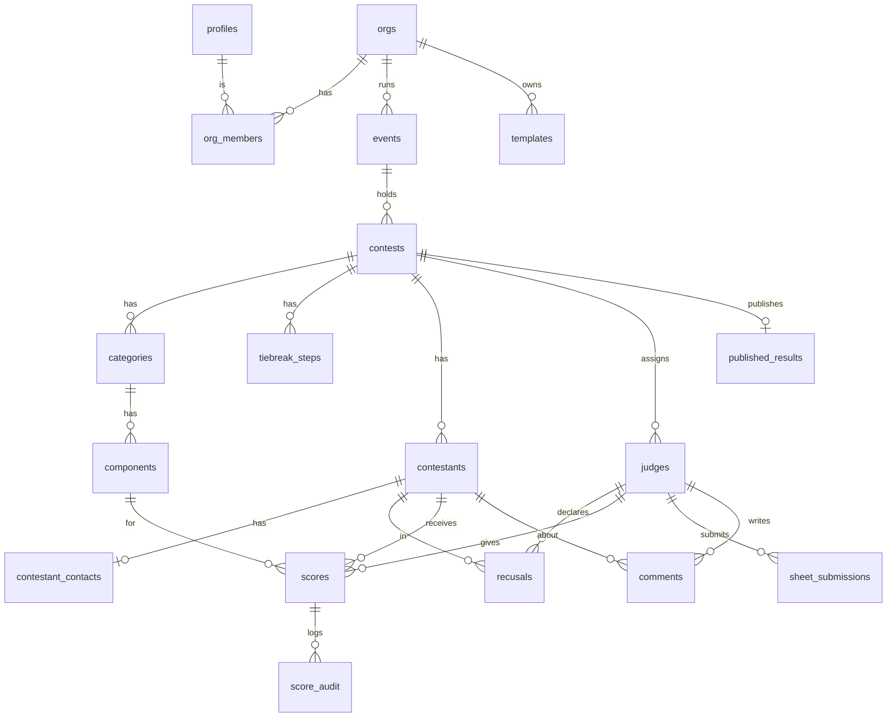

# 01 — Domain Model

Every table has `id uuid pk default gen_random_uuid()` and `created_at timestamptz default now()`. Only extra columns are listed below. Every table has RLS enabled (see [03-auth-rls.md](03-auth-rls.md)).

## ERD

## Tables

### Tenancy & identity
| Table | Columns | Notes |
|---|---|---|
| `profiles` | `id` (= `auth.users.id`), `display_name`, `is_platform_admin bool default false` | Created by a trigger on signup. Users can't change `is_platform_admin` themselves. |
| `orgs` | `name` | The creator becomes a producer through an RPC `create_org(name)`. URLs use the id. |
| `org_members` | `org_id`, `user_id`, `role` ∈ `producer`,`tabulator` | unique(org_id,user_id). An org always keeps at least 1 producer (trigger). |

### Structure
| Table | Columns | Notes |
|---|---|---|
| `events` | `org_id`, `name`, `starts_on date`, `venue text null` | |
| `contests` | `event_id`, `org_id` (copied from the event by trigger, keeps RLS predicates cheap), `status` ∈ `draft`,`scoring`,`finalized`,`published`; `aggregation` ∈ `sum`,`drop_high_low`; `threshold_pct numeric(5,2) null` (null = no threshold); `anonymize_comments bool default true`; `manual_winner_reason text null`; `final_result jsonb` and `finalized_at` (set only by `finalize_contest`); rounds: `finalist_count int null` (null = one round), `prelim_aggregation`, `prelim_carries bool`, `finalists_confirmed_at` (set only by `confirm_finalists`); `report_as` ∈ `total`,`average`; `threshold_single_only bool` | `status` has no client write privilege; it changes only through RPCs. `aggregation` and `threshold_pct` lock with the rubric. `manual_winner_contestant_id` arrives with `contestants`. |
| `categories` | `contest_id`, `name`, `sort int`, `drop_rank int null`, `round` ∈ `prelim`,`final` (default final), `scored_by` ∈ `judges`,`producer`, `guest_average bool`, `deductions jsonb` (`[{label, points} | {label, percent}]`) | `drop_rank` 1 = dropped first in tiebreaks. Not unique; the UI rewrites all ranks together. Deleting a category prunes it from `tiebreak_steps`. |
| `components` | `category_id`, `name`, `min_points numeric(6,2) default 0`, `max_points numeric(6,2)`, `step numeric(4,2) default 1`, `sort int`, `description text null` | CHECK `min_points >= 0`, `max_points > min_points`, `step > 0`, and the range is a whole number of steps. |
| `tiebreak_steps` | `contest_id`, `step_no int`, `category_ids uuid[]`, `all_judges bool` | pk(contest_id, step_no). Auto-generated from `drop_rank`, then editable. A trigger rejects categories from other contests. Locks with the rubric. |

### People
| Table | Columns | Notes |
|---|---|---|
| `contestants` | `contest_id`, `display_name`, `number int null`, `represents text null` (e.g. "Mr Chicago Leather 2026"), `sort int`, `withdrawn bool default false`, `finalist bool` (set only by `confirm_finalists`) | No legal name, phone or address, ever. unique(contest_id, number). Deletable only in draft; after that, withdraw instead. |
| `contestant_contacts` | `contestant_id pk`, `email` | Split out so judges and tabulators can read contestants without seeing emails. |
| `judges` | `contest_id`, `name`, `email null`, `user_id null`, `sort int`, `guest bool` (cross-panel) | `user_id` stays null in P1 (the producer enters for them). It's set only by the claim RPC (P2); clients have no write privilege on it. unique(contest_id, user_id). Deletable only in draft. |
| `recusals` | `judge_id`, `contestant_id`, `reason text null` | pk(judge_id, contestant_id). A trigger requires both to be in the same contest. |

### Scoring
| Table | Columns | Notes |
|---|---|---|
| `scores` | `contest_id` (set by trigger), `judge_id`, `contestant_id`, `component_id`, `value numeric(6,2)`, `entered_by uuid` (set by trigger), `updated_at` | **unique(judge_id, contestant_id, component_id)**. A trigger requires all three to be in the same contest, the contest to be in `scoring`, the value to be in range and on a step, and the judge not to be recused. Sheet locking is added with `sheet_submissions` in P2. |
| `sheet_submissions` | `judge_id`, `contestant_id`, `category_id`, `submitted_at`, `submitted_by`, `unlocked_at null`, `unlocked_by null`, `unlock_reason null` | A sheet is locked when `submitted_at` is set and `unlocked_at` is null. Re-submitting clears the unlock fields. |
| `penalties` | `contest_id` (set by trigger), `contestant_id`, `category_id`, `tier` (index into the category's deductions), `created_by` | One row per deduction applied. Producers and tabulators add/remove while scoring. |
| `score_audit` | `score_id`, `contest_id`, `judge_id`, `contestant_id`, `component_id`, `old_value`, `new_value`, `changed_by`, `changed_at`, `op` ∈ `insert`,`update`,`delete` | Written only by a trigger (security definer); saves that don't change the value are skipped. Producers read it. Nobody can write, update or delete it. |
| `comments` | `judge_id`, `contestant_id`, `category_id null`, `body text`, `edited_body text null`, `approved bool default false`, `updated_at` | Producers edit `edited_body`. Exports use `coalesce(edited_body, body)` where `approved`. |
| `published_results` | `contest_id pk`, `snapshot jsonb`, `show_breakdown bool`, `published_at`, `published_by` | Frozen output of the scoring engine. The only scoring data anonymous users can read. |

### Templates
| Table | Columns | Notes |
|---|---|---|
| `templates` | `org_id null`, `name`, `description`, `visibility` ∈ `private`,`public`,`curated`, `rubric jsonb`, `created_by` | `rubric` = `{aggregation, threshold_pct, anonymize_comments, categories:[{name, drop_rank, components:[{name, description, min_points, max_points, step}]}], tiebreak_steps:[[categoryIndex…]]}`. Created only by `save_contest_as_template`; clients can edit name, description and visibility. `curated` requires a platform admin and `org_id` null. |

## Key flows on the model
- **Clone a contest.** RPC `clone_contest(contest_id, target_event_id)` copies the contest settings, categories, components and tiebreak steps. It doesn't copy contestants, judges or scores. **Apply template** does the same from `rubric` jsonb, and **Save as template** does the reverse. All three produce copies, never live links.
- **Status transitions** go through an RPC `set_contest_status(contest_id, status)`. Built so far: `draft → scoring` (needs a component, a contestant and a judge) and `scoring → draft` (only before any score exists). Planned:
  - `draft → scoring` locks the rubric. A trigger blocks category/component edits once status ≠ draft.
  - `scoring → finalized` goes through `finalize_contest(contest_id, result)`: the browser sends the engine's result, the database checks the caller is a producer, no expected score is missing (recused cells excluded), and the outcome is a winner in this contest or no title, then freezes it in `final_result`.
  - `finalized → published` writes `published_results`.
  - Producers can reopen `finalized → scoring`, which discards `final_result`.
- **Withdrawn contestant.** Kept for the record, excluded from standings.
